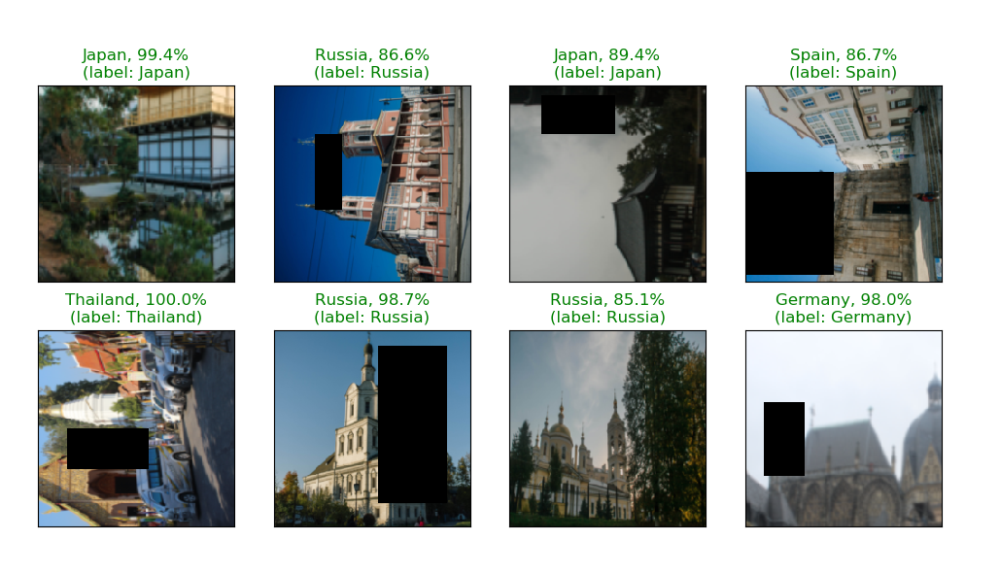
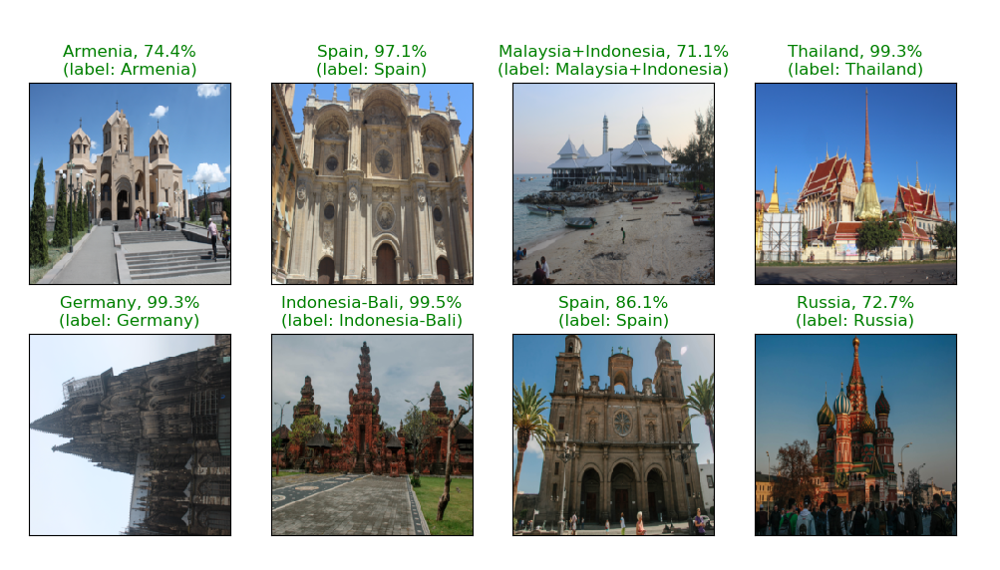

  

# Temples Classifier 
This repository contains the training code for classifying temples by their origin country. Currently, there are multiples models supported: 
[ResNet-50 / Resnet-101](https://arxiv.org/pdf/1512.03385.pdf), [PSPNet-50 / PSPNet-101](https://arxiv.org/pdf/1612.01105.pdf) and 
[VGG](https://arxiv.org/pdf/1409.1556.pdf). The preprocessing is based on the [Inception paper](https://arxiv.org/pdf/1409.4842.pdf). 
The input image is resized to `256x256` and crops of random size (0.08 to 1.0  of the original size) and a random aspect ratio 
(3/4 to 4/3 of the original aspect ratio) are made. This crop is finally resized to `224x224`. Furthermore, random 90 degrees rotations
of the input image and random gaussian blur is applied. Optionally, a random patch from the image is erased (pixel values are set to 0).

## Training on the temples dataset
1. Download the [temples dataset](https://drive.google.com/file/d/1zTPipCiBYdeOhSedwnRbTNKyYS6Wu4T5/view?usp=sharing). 
2. Set the path to your dataset in the [temples dataloader file](dataloader/temples.py). Currently, 85% of the dataset is used for training
and 15% for validation.
3. Check the [available parser options](parser_options.py).
4. Create the environment from the [conda file](environment.yml): `conda env create -f environment.yml`
6. Activate the conda environment: `conda activate toptal`
7. Train the networks using the provided [training script](main.py). The trained model is saved to the `save_dir` command line argument.
8. Run the [inference script](infer.py) on your set. The command line argument `test_dir` should be used to provide the
relative path to the folder which contains the images to be classified. A file `results.csv` will be created containing the name
of the files in the folder and the corresponding predicted class.

## Results ResNet-50 with random erasing

  

### Effect of model choice

| Model         | Accuracy      | 
| ------------- |:-------------:| 
| ResNet-50     | 0.8143 | 
| ResNet-100    | 0.802      | 
| PSPNet-50     | 0.785      |
| PSPNet -100   | 0.778      |

### Effect of random erasing
| Model         | Accuracy      | 
| ------------- |:-------------:| 
| ResNet-50     | 0.8143 | 
| ResNet-50 random erasing    | 0.8333      | 

